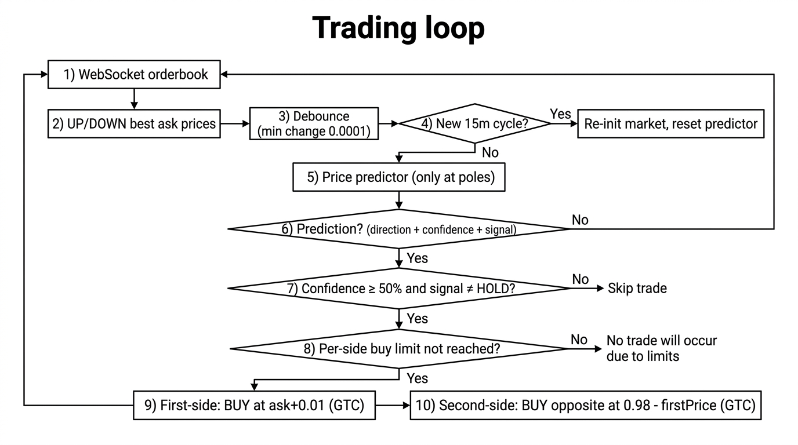
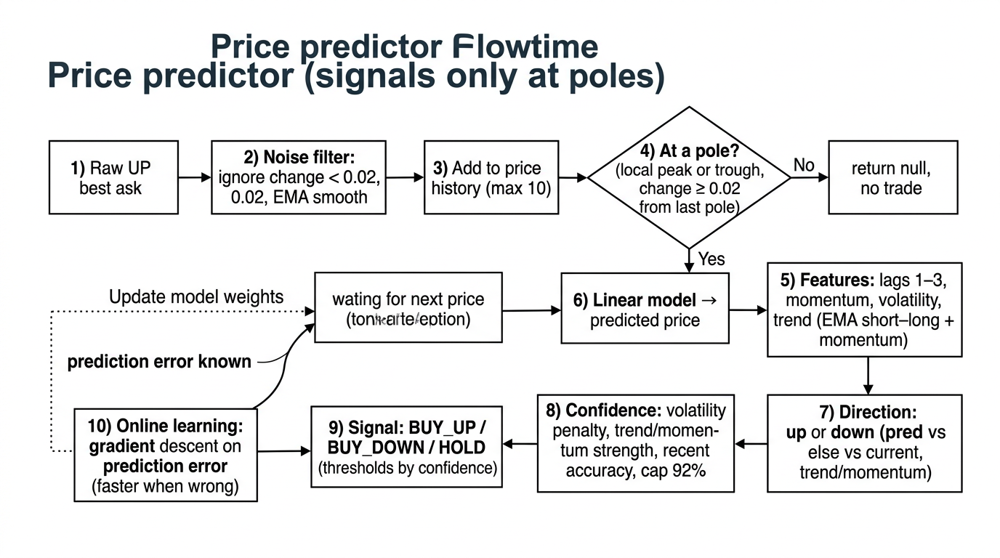
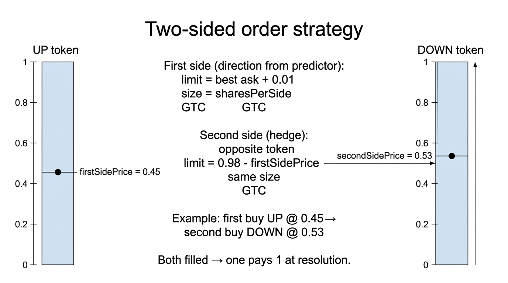

# Polymarket 15m Up/Down Trading Bot

Automated trading on Polymarket’s 15-minute Up/Down markets (e.g. BTC, ETH, SOL). The bot subscribes to the CLOB orderbook over WebSocket, uses an in-house price predictor to choose direction, and places limit orders via the Polymarket CLOB API. Built in TypeScript.

---

## What it does

- **Markets:** Trades the rolling 15m Up/Down markets (slug pattern: `{ticker}-updown-15m-{timestamp}`).
- **Signals:** An adaptive predictor (momentum, volatility, trend, pole detection) outputs BUY_UP or BUY_DOWN; orders are only placed when confidence and alignment thresholds are met.
- **Execution:** Limit orders at best ask (with optional price buffer). Optional fire-and-forget to avoid blocking on confirmations. Can hedge the other side; state is persisted so the bot can resume cleanly across restarts.
- **Lifecycle:** Waits for a minimum USDC balance and optional “next 15m boundary” before trading. Tracks positions and can generate per-cycle prediction summaries. Redeem scripts are provided to settle resolved markets.

You need a funded Polymarket wallet (Polygon USDC) and API credentials. Trading is real; run at your own risk.

---

## Strategy logic

The bot trades only at **turning points** (local peaks and troughs) of the UP token price, then places a **first-side** order in the predicted direction and a **second-side** limit order on the opposite outcome to hedge.

### High-level flow

Diagrams: `assets/docs-trading-loop.png`, `assets/docs-predictor-pipeline.png`, `assets/docs-two-sided-orders.png`. Add these files to `assets/` if images don’t show.



1. **WebSocket orderbook** — Subscribes to UP/DOWN token books; uses **best ask** for the UP token (and DOWN when needed).
2. **Debounce** — Processes an update only when UP best ask changes by at least `0.0001` to avoid reacting to every tick.
3. **15m cycle** — Slug is `{ticker}-updown-15m-{timestamp}` (e.g. `btc-updown-15m-1739563200`). On the next 15m boundary the bot detects the new slug, fetches new token IDs, re-subscribes, and **resets the price predictor** for that market.
4. **Price predictor** — Runs only when the current smoothed price is at a **pole** (local peak or trough). Otherwise returns no prediction and no trade.
5. **Trade gate** — Requires prediction confidence ≥ 50%, signal ≠ `HOLD`, and per-side buy count below `COPYTRADE_MAX_BUY_COUNTS_PER_SIDE` (if set).
6. **First-side order** — BUY the chosen outcome (UP or DOWN) at **best ask + 0.01**, size = `COPYTRADE_SHARES`, GTC.
7. **Second-side order** — BUY the **opposite** outcome at limit **0.98 − firstSidePrice**, same size, GTC. Fills are tracked asynchronously; when the limit fills, that side’s count and cost are updated.

### Predictor pipeline (signals only at poles)



- **Input:** Stream of UP token best-ask prices.
- **Noise filter:** Ignore price changes under 0.02; smooth with EMA (α = 0.5). Build a rolling price history (max 10 points).
- **Pole detection:** A **pole** is a local peak (current price higher than previous 2–3) or trough (current price lower than previous 2–3). A new pole is accepted only if:
  - It’s the first pole, or
  - Change from last pole ≥ 0.02, or
  - Pole type flips (peak → trough or vice versa).  
  If we’re not at a pole, the predictor returns `null` → no trade.
- **Features:** From the smoothed history: price lags 1–3, **momentum** (short-term price change), **volatility** (e.g. last 5 prices’ std dev), **trend** (combination of EMA short − long, momentum, and medium-term price change).
- **Model:** Linear combination of features (intercept + lags + momentum + volatility + trend) → **predicted next price**. Weights are updated with **online gradient descent** on prediction error (higher learning rate when the direction was wrong).
- **Direction:** Compare predicted vs current price (threshold 0.02); if the move is small, direction comes from trend/momentum. Output is always **up** or **down** (no neutral).
- **Confidence:** Combines volatility penalty (low vol → higher confidence), trend/momentum strength, prediction magnitude, alignment of momentum with direction, and recent/overall prediction accuracy. Capped at 92%; can be reduced when recent high-confidence predictions were often wrong.
- **Signal:** `BUY_UP` / `BUY_DOWN` / `HOLD` from confidence and feature thresholds (e.g. strong trend + alignment + acceptable volatility). Only non-HOLD signals with confidence ≥ 50% lead to orders.

### Two-sided order formula



| Order       | Side    | Limit price              | Size           |
|------------|---------|---------------------------|----------------|
| First-side | UP or DOWN (from predictor) | best ask + 0.01 | `COPYTRADE_SHARES` |
| Second-side | Opposite | **0.98 − firstSidePrice** | same           |

Example: predictor says “up”, UP best ask = 0.45 → first order BUY UP @ 0.46; second order BUY DOWN @ 0.98 − 0.45 = 0.53. At resolution exactly one of UP/DOWN pays 1; the other pays 0.

### Risk controls

- **Per market, per 15m cycle:** Optional cap `COPYTRADE_MAX_BUY_COUNTS_PER_SIDE` (e.g. 50). When both UP and DOWN buy counts reach the limit, the market is **paused** for the rest of that cycle.
- **Balance:** Bot won’t start until USDC balance ≥ `BOT_MIN_USDC_BALANCE`; can optionally stop if balance drops below `COPYTRADE_MIN_BALANCE_USDC`.
- **Summaries:** At each 15m boundary and on shutdown, the bot logs a prediction score summary (correct/wrong, costs per side, total cost) for the just-finished cycle.

---

## Requirements

- Node 18+
- A `.env` file with at least `PRIVATE_KEY` (and optionally RPC/CLOB/logging/copytrade settings — see below)

---

## Setup

```bash
git clone https://github.com/harmandhaliwal/Polymarket-15m-Up/Down-Trading-Bot.git
cd Polymarket-15m-Up/Down-Trading-Bot
npm install
cp .env.temp .env
# Edit .env and set PRIVATE_KEY (and any other vars you need)
```

Create the API credential once (stored locally); the app will prompt if it’s missing:

```bash
npm start
```

---

## Configuration

Copy `.env.temp` to `.env` and fill in what you need. The codebase reads everything via `src/config/index.ts`.

| Variable | Purpose |
|----------|--------|
| `PRIVATE_KEY` | Wallet private key (required for trading and redeem). |
| `RPC_URL` / `RPC_TOKEN` | Optional; used for balance, allowance, and redeem on Polygon. |
| `USE_PROXY_WALLET` | Set to `true` if you use Polymarket’s proxy wallet. |
| `CLOB_API_URL` | CLOB API base (default: `https://clob.polymarket.com`). |
| `BOT_MIN_USDC_BALANCE` | Bot won’t start until balance ≥ this (default: 1). |
| `COPYTRADE_WAIT_FOR_NEXT_MARKET_START` | If `true`, wait for the next 15m boundary before trading. |
| `COPYTRADE_MARKETS` | Comma-separated tickers, e.g. `btc` or `btc,eth,sol`. |
| `COPYTRADE_SHARES` | Target size per side (e.g. 5). |
| `COPYTRADE_TICK_SIZE` | e.g. `0.01`. |
| `COPYTRADE_PRICE_BUFFER` | Extra cents at which to place orders (can help fills). |
| `COPYTRADE_FIRE_AND_FORGET` | Don’t wait for order confirmation (default: true). |
| `COPYTRADE_MIN_BALANCE_USDC` | Stop trading if balance drops below this. |
| `COPYTRADE_MAX_BUY_COUNTS_PER_SIDE` | Cap buys per side per market (0 = no cap). |
| `LOG_DIR` / `LOG_FILE_PATH` | Where to write logs (e.g. `logs`, or a path with `{date}`). |

Redeem scripts also use:

- `CONDITION_ID` and `INDEX_SETS` (or pass them on the command line).

---

## Scripts

| Command | Description |
|---------|-------------|
| `npm start` | Run the trading bot (CLOB client, allowances, balance check, then copytrade loop). |
| `npm run redeem` | Redeem positions for a resolved market (condition ID + index sets from env or args). |
| `npm run redeem:holdings` | Redeem from fetched holdings. |
| `npm run redeem:proxy` | Redeem via proxy wallet. |

On SIGINT/SIGTERM the bot shuts down and writes final prediction summaries before exiting.

---

## How it works (short)

1. Load config and create or load API credentials; initialize CLOB client.
2. Approve USDC allowance and sync with CLOB; wait until `BOT_MIN_USDC_BALANCE` is satisfied.
3. Optionally wait until the next 15m boundary (`COPYTRADE_WAIT_FOR_NEXT_MARKET_START`).
4. For each `COPYTRADE_MARKETS` ticker, resolve the current 15m slug from Gamma, fetch token IDs, and subscribe to the WebSocket orderbook for those tokens.
5. On price updates, the predictor runs only at **poles** (see [Strategy logic](#strategy-logic)). If it returns BUY_UP or BUY_DOWN and confidence/gate checks pass, the bot places the first-side limit order (ask+0.01) and the second-side hedge (0.98 − firstPrice). State is saved to `src/data/copytrade-state.json`.
6. When the clock rolls to a new 15m window, the bot detects the new slug, re-initializes token IDs and subscriptions, resets the predictor for that market, and logs a prediction summary for the previous cycle.

Logs go to the directory you set in `LOG_DIR` or `LOG_FILE_PATH`; summaries and PnL use the same logging config.

---

## Data and logs

- **State:** `src/data/copytrade-state.json` (created if missing; keep it out of version control if it contains sensitive data).
- **Logs:** Under `logs/` by default, or the path you set in `.env`. PnL and summaries use the same logging directory when configured.

---

## License

ISC. See `package.json` for author and license details.
